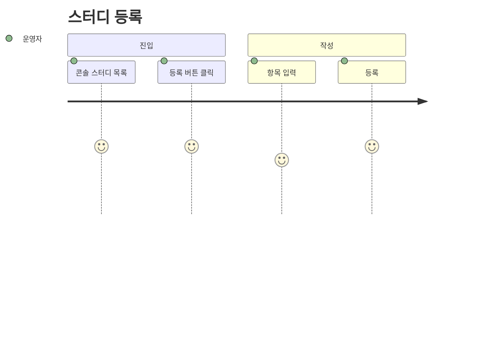
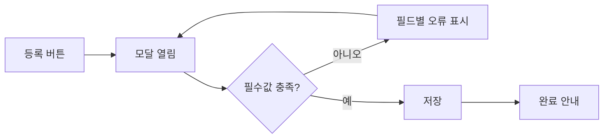
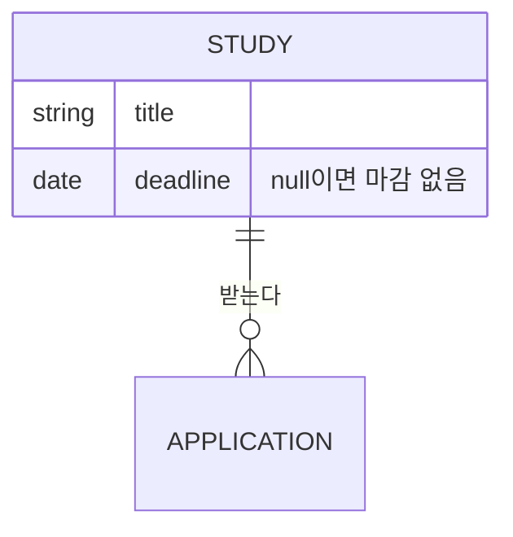

# PRD 작성 가이드 (웹 구축)

> **한 기능 = 문서 하나.** Story PRD 가 그 기능의 유일한 산출물이며, 화면·동작·데이터·시스템 요건을
> 전부 담는다. 기능정의서(FS)·사용자 시나리오(US)를 **별도 문서로 쪼개지 않는다.**
>
> Story 는 `stories.md` 가 마스터이며 PRD 는 그 **투영**이다. PRD 에서 스토리를 창작하지 않는다.
>
> Feature PRD 는 **Story 가 여러 개 쌓인 뒤에만** 만든다 (화면 전체 조립도가 필요해질 때). 기본은 Story PRD 하나.

## 0. Hard Gate — PRD 착수 조건

아래 중 **하나라도** 충족해야 시작한다. 미충족이면 Ingest 로 Story 등재까지만 하고 그 사실을 보고한다.

- 프로토타입 코드(JSX/HTML 등)가 `SRC-####` 로 등재됨
- 또는 화면 캡처 **5장 이상**
- 또는 구동 중인 제품(PUD)의 해당 화면

> 화면 없이 쓴 PRD 는 화면이 나오면 대부분 다시 쓴다. **프로토타입 First.**

---

## 1. Story PRD — `stories/{story-slug}/PRD.md`

### 1.0 자족성 Hard Rule (최우선)

**Story PRD 하나만 보면 기획자·디자이너·개발자가 다른 문서로 가지 않고 그 Story 를 완결할 수 있어야 한다.**

- 그 Story 의 **전체 완료 기준·전체 동작 규칙·전체 데이터 요구**를 모두 담는다
- 요약·발췌본 금지 — **원문이 곧 Story PRD**. "Feature PRD 에서 보세요" 식 위임 금지
- 예외: **다른 Story·화면 전체 조립**만 Feature PRD §4.5 로 링크 (범위 밖이라서지 축약이라서가 아님)

### 1.0-A ID·메타를 쓰지 않는 경우 (Hard Rule)

`ST-###`·`IA-###`·`SRC-####`·`module`·`features` 는 **레지스트리가 실제로 존재할 때만** 쓴다.

- **레지스트리가 있다** = 프로젝트 레포에 `01-planning/_registry/stories.md`(발번 대장 포함)가 실재하고
  거기서 번호를 발급받았다
- **없으면 쓰지 않는다.** 문서 하나를 노션·구글독스 등에 단건으로 쓰는 상황이면 ID 체계가 없는 것이다

> **없는 레지스트리의 ID 를 지어내지 않는다.** `ST-012` 처럼 그럴듯한 번호를 적으면
> 읽는 사람은 어딘가에 그 번호의 원장이 있다고 믿는다. 찾으면 없다.
> 이건 규칙 위반이자 문서 신뢰를 깎는 행위다.

**대신 무엇을 적는가**

| 상황 | 메타 줄 |
|---|---|
| 레지스트리 있음 | `story_id: ST-012 · module: … · sources: [SRC-0001]` |
| 레지스트리 없음 (단건 문서) | `기준 프로토타입: <지면 이름> — <배포된 프로토 URL>` 한 줄. 그 외 생략 |

Actor 는 제목의 정규문장이 이미 말하므로 메타에 중복해 적지 않는다.

### 1.1 제목 규칙 (Hard Rule)

Story PRD 제목은 **정규문장 그 자체**. 요약·축약 라벨 금지.

```
# 운영자로서, 스터디를 등록할 수 있다.
```

### 1.2 구성 — 최대 3 섹션 (필수 1 + 옵션 2)

````markdown
# [Actor]로서, [목표/행동]할 수 있다.

<!-- 메타 줄: **실재하는 것만** 적는다. 아래 §1.0-A 참조.
     레지스트리를 안 쓰는 프로젝트라면 이 줄 자체를 생략하고 기준 프로토타입만 적는다. -->
기준 프로토타입: <어느 화면인지>

## 1. 기본설명 (필수)

· **배경** — **기본은 쓰지 않는다.** 대부분의 기능은 배경이 필요 없다 —
  「유저 목록을 본다」·「스터디를 등록한다」처럼 **있을 법한 기능**은 제목이 이미 이유다.

  **쓰는 경우는 하나뿐이다**: 이 Story 를 **모르면 잘못 만들게 되는 사정**이 있을 때.
  판단은 「왜?라고 물을까」 같은 느낌이 아니라 다음 둘을 **모두** 만족하는지로 한다.
  1. 그 사정이 **요건을 바꾼다** (모르고 만들면 다른 물건이 나온다)
  2. 그 사정이 **다른 절에 들어갈 자리가 없다**

  **여기 쓰면 안 되는 것 — 「지금 시스템의 한계」.**
  「저장할 테이블이 없다」·「권한을 바꾸려면 코드 수정·배포가 필요하다」는 배경이 아니라 **미구현 현황**이다.
  §4 비고의 **미구현**으로 보낸다. 이 오용이 배경 섹션이 살아남는 가장 흔한 경로다.

· **진입·사용 흐름** — 어디서 들어와 어떤 순서로 쓰는가. **사용자 시점 행동**이지 시스템 구현이 아니다.
  **User Journey 다이어그램을 여기 동봉**(§1.3). 텍스트 나열만 두지 않는다.

· **완료 기준** — **이 Story 가 하는 일은 여기서만 말한다.** 별도의 「하는 일」 절을 두지 않는다 —
  둘을 나누면 같은 내용을 명사형과 서술형으로 두 번 쓰게 되고, 고칠 때 한쪽만 고쳐진다.
  개요는 제목이 이미 담당한다.
  - **번호 목록(1. 2. …)** 으로. 체크박스·`AC#` 접두사 안 씀(독자에겐 잡음). 최소 1개
  - **존재가 아니라 결과로 쓴다.** 「필터가 있다」(X) → 「필터로 대상을 좁힐 수 있다」(O).
    있다/없다가 아니라 **되느냐**로 쓴다 — 합치면 기능 나열로 퇴화하기 쉽다
  - **상태·예외도 여기 포함한다** — 빈 결과·차단·값 없음처럼 「그때 무엇이 보이는가」도 완료 조건이다
  - 화면에서 확인할 수 있는 것만. 원칙·설계 의도는 §2 정책으로 (§1.4-B)

## 2. 화면명세 (UI 동작이 있는 Story 면 필수)

> 디자이너·개발의 1차 문서. 이 절만 보고 착수할 수 있게 자족적으로.
> **시각(번호) + 동작 + 정책 + 데이터를 한 절에** 담고, **번호마다 그 요소 규칙이 바로 밑에** 모이게 한다.

· **화면** — 번호 뱃지(`1`·`1-1`·`1-2`…)를 얹은 기준 시안. 이미지 **바로 위에 한 줄만**:
  `> **화면**: <지면 이름> — <배포된 프로토 URL>`
  이미지에 설명 캡션을 달지 않는다. 양식 안내 문구도 넣지 않는다.

  **프로토 링크는 남이 열 수 있는 주소여야 한다 (Hard Rule)**
  - `localhost`·`127.0.0.1`·사설 IP(`192.168.*`)를 문서에 적지 않는다. 쓰는 사람 기계에서만 열린다
  - `/proto/console/users` 같은 **상대 경로만 적지 않는다.** 읽는 사람이 앞에 무엇을 붙일지 모른다
  - **배포된 프로토의 절대 URL**을 적는다. 배포본이 없으면 링크를 걸지 말고 지면 이름만 적는다
  - 링크를 걸기 전에 **그 URL 이 실제로 열리는지, 그리고 문서가 설명하는 화면과 같은지** 확인한다.
    아직 머지·배포되지 않은 변경을 문서로 먼저 공유하면, 읽는 사람은 옛 화면을 보고 문서가 틀렸다고 판단한다

· **번호별 명세** — 각 번호를 소제목으로 두고 그 밑에 모두 모은다:
  - **내용**: 그 요소가 **사용자에게 알려주는 것** (값의 뜻·라벨 문구·기본값·단위·없을 때 대체 표기).
    형태는 쓰지 않는다 — §1.4-A
  - **동작**: 조작 시 무슨 일이 일어나는가 (분기 포함)
  - **정책**: 판정 규칙·제약 — **개발자가 그대로 구현할 수 있는 문장**만 (POL-#### 있으면 링크, 본문 복붙 금지).
    이유를 쓰려면 규칙 뒤에 붙인다. 규칙 없이 이유만 적지 않는다 — §1.4-B
  - **데이터(DR)**: 어떤 값을 읽고 쓰는가
  - **작업**: 이 요소를 만들기 위해 필요한 일

· **상태별 화면** — 표로. **실제 카피 문구를 그대로** 기입 (§1.5)

· **전체 화면에서의 위치** (참고) — IA-### + Feature PRD §4.5 링크. `(배치·순서 → §4.5)`

· **(DR 있으면) 데이터 관계** — 간단 ERD (§1.6)

· **비고** — 세 가지만: **범위 밖** · **미구현** · 특정 번호에 안 붙는 **구현 지시**.
  범위 밖은 **한 줄로 묶어** 나열한다. 형제 Story 마다 줄을 늘어놓지 않는다. — §1.4-C

## 3. 시스템 요건 (필수 — 별도 FS 문서를 만들지 않는다)

화면 뒤에서 필요한 것을 여기에 담는다. 개발자가 이 절만 보고 서버 작업을 시작할 수 있어야 한다.

· **데이터** — 이 Story 가 읽고 쓰는 필드. 타입·필수·제약·null 의 의미
· **처리** — 검증(서버 기준) · 저장 · 실패 응답 · 완료 정의
· **계산 규칙** — 저장하지 않고 계산하는 값이 있으면 그 식과 **단일 정의 위치**
· **API** — 메서드 · 경로 · 권한
· **권한** — 동작별 허용 대상과 **검증 위치(서버/클라이언트)**
· **외부 연동(SYS-02)** — 해당 시. 실패·타임아웃·재시도·사용자 노출 문구
· **(AI 해당 시)** 입력/출력 · 프롬프트 의도 · 가드레일 · 사람 검토 지점

## 4. 미확정

결정이 필요한 항목. 결정되면 본문에 반영하고 여기서 지운다.
````

### 1.3 User Journey 다이어그램 규칙

**단선 흐름** — `journey`



**분기 있는 흐름** — `flowchart LR`



**분기로 넣을 것 / 넣지 말 것 (Hard Rule)**

분기는 **사용자가 실제로 겪는 갈림길**만 넣는다. 입력값에 따른 결과 차이는 넣지 않는다.

| | 예 |
|---|---|
| 넣는다 | 검증 실패 → 되돌아감 · 이탈·취소 · 권한 없음 · 흐름이 두 화면으로 갈라짐 |
| 넣지 않는다 | 어떤 선택 필드를 채웠는지에 따른 결과 차이 |

> 선택 필드마다 분기를 그리면 흐름도가 아니라 진리표가 된다.
> 필드 값이 만드는 결과 차이는 **번호별 명세와 판정 표**가 담당한다.
>
> 나쁨: `{공개일 지정?} →비움→ 즉시공개 / →미래→ 예약공개`
> (선택 필드가 4개면 분기도 4개가 되어야 하는데, 하나만 그리면 왜 그것만인지 설명이 안 된다)

체크리스트:
- [ ] 사용자 **행동**으로 썼는가 (시스템 내부 처리 X)
- [ ] 실패·이탈 분기가 있는가
- [ ] **선택 필드 값에 따른 분기를 넣지 않았는가**
- [ ] 노드 라벨에 특수문자가 있으면 `"…"` 로 감쌌는가

### 1.4 번호 명세 규칙 (Hard Rule)

- **한 Story = 한 번호 세트 (Hard Rule).** 번호는 **Story 마다 1 부터 다시 매긴다.**
  한 지면에 Story 가 여럿 살아도 화면 통번호를 나눠 쓰지 않는다 — 그러면 어느 문서는 `1·4·5·6`
  처럼 건너뛰게 되고, 빠진 번호를 설명하는 문장(「2·3 은 다른 Story 소관」)이 따라붙는다.
  그 문장은 §3 이 금지한 번호 체계 해설이다
- 번호는 **화면 위 요소 위치 기준**으로 부여. 큰 영역이 `1`, 그 안의 요소가 `1-1`·`1-2`
- **요소 완전성**: 본 Story 영역의 시각 요소는 **빠짐없이** 어느 번호의 내용 또는 데이터에 설명이 있어야 한다
  - 배지·상태칩·아이콘·숫자·컬럼 헤더·토글·카운터·툴팁·색 상태 전부
  - 숫자·코드가 보이면 **"그 숫자가 무엇인지"** 반드시 명시
- **다른 Story 소관 영역은 넣지 않는다.** 각 요소는 자기 Story PRD 에서 1회만 설명
- **캡처에 보이지 않는 요소에는 번호를 매기지 않는다 (Hard Rule).** 번호는 시안 위의 요소를
  가리키는 표지다. 그림에 없는 것에 번호를 달면 읽는 사람은 없는 배지를 찾아 헤맨다.
  - 조건부로만 보이는 요소는 그 상태의 캡처를 **한 장 더** 넣고 번호를 유지한다
  - 캡처를 넣을 수 없으면 번호를 떼고 **비고에 글로** 적는다 (예: 모든 화면 하단 푸터처럼
    이 지면 밖에 사는 요소)
- 검증: 캡처의 요소 목록화 → 번호별 명세와 1:1 대조 → **미설명 요소 0** 확인.
  하나라도 남으면 화면명세 미완성(라운드 종결 차단)

**번호 배지를 캡처에 얹을 때 (Hard Rule)**

배지를 화면 위에 오버레이해 캡처하는 경우, 잘못된 요소에 붙어도 그림만 봐서는 알아채기 어렵다.

- **요소는 라벨 텍스트로 특정한다.** CSS 클래스·`querySelector` 첫 매치로 잡지 않는다 —
  같은 클래스가 여러 곳에 쓰이면 문서 순서상 먼저 나온 엉뚱한 요소가 잡힌다
- **붙인 뒤 반드시 되돌려 대조한다.** 배지마다 `번호 → 대상 요소의 실제 텍스트` 목록을 출력해
  의도한 요소가 맞는지 1:1로 확인한다. 대조표 없이 캡처만 보고 넘어가지 않는다
- 대상을 못 찾으면 조용히 건너뛰지 말고 **실패로 보고**한다

### 1.4-A 「내용」은 요건이지 화면 묘사가 아니다 (Hard Rule)

**디자이너는 형태를 바꾼다.** 도넛을 막대로, 칩을 드롭다운으로, 세 칸을 한 칸으로 바꿀 수 있다.
그때 기획서가 틀린 문서가 되면 안 된다. 기획서가 잡는 것은 **무엇을 알려줘야 하는가**이지
**어떻게 그리는가**가 아니다.

**판별 질문 — 「디자이너가 형태를 바꾸면 이 문장이 거짓이 되는가?」**
거짓이 되면 그건 화면 묘사다. 문장을 그 요소가 답하는 **질문**으로 바꿔 쓴다.

| 쓰지 않는다 (형태) | 이렇게 쓴다 (요건) |
|---|---|
| 도넛 + 범례 | 지역별 비율과 인원을 함께 알려준다 |
| 최근 12주 꺾은선. X축 라벨 4주 간격 | 최근 12주의 출석률 변화를 시간 순으로 알려준다 |
| 카드 오른쪽 위 세그먼트 토글 | 이 카드 안에서 범위(진행중·누적)를 바꾼다 |
| 세 칸이 나란히. 탭 없음 | 세 묶음을 한 화면에서 동시에 본다 |
| 주황 배지 · 빨강 굵게 | 마감이 임박한 건과 지난 건을 구분해 알려준다 |
| 44px 고정 행 · 268px 고정 높이 | 건수가 달라져도 아래 요소가 밀려 내려가지 않는다 |

**예외 — 형태를 적어도 되는 두 경우**
1. **그렇게 하지 않으면 요건이 깨질 때.** 「가로는 회차, 세로는 크루」처럼 배치 자체가 뜻을 만드는 경우.
   이때도 **왜 그 형태여야 하는지**를 정책에 함께 적는다. 근거 없이 형태만 적지 않는다
2. **문구 그 자체.** 사용자에게 보이는 카피는 §1.5 대로 따옴표 안에 그대로 적는다

**색은 언제나 요건으로 쓴다.** 「빨강」이 아니라 「지난 건과 남은 건을 구분한다」로 적는다.
색만으로 가르지 않는다는 접근성 요건은 정책에 적는다 (수치·텍스트 병기).

### 1.4-B 「정책」은 규칙이지 소감이 아니다 (Hard Rule)

정책 한 줄을 읽고 **무엇을 어떻게 판정할지 정해지지 않으면** 그건 규칙이 아니다.
읽는 사람은 「좋은 말인데 그래서 뭘 하라는 거지」에서 멈춘다.

**판별 질문 — 「이 문장대로 코드를 짤 수 있는가?」**

| 쓰지 않는다 (소감·수사) | 이렇게 쓴다 (규칙) |
|---|---|
| 지금 굴러가는 분야와 지금까지 많이 해 온 분야는 다른 질문이다 | 진행중은 종료된 스터디를 빼고 센다. 누적은 종료분까지 센다 |
| 순서에 뜻을 담으려면 그 기준이 화면에 보여야 한다 | 이름순으로 고정한다. 화면에 없는 값(출석률·회차)으로 정렬하지 않는다 |
| 읽던 자리를 잃지 않아야 한다 | 건수가 0이든 최대든 이 영역의 높이는 같다 |
| 사람이 손해를 보면 안 된다 | 휴가는 분모에서 뺀다. 지각은 0.5로 센다 |

**이유는 규칙 뒤에 붙인다.** 「휴가는 분모에서 뺀다 — 미리 알리고 빠진 것을 결석과 같이 세면
성실한 사람이 손해를 본다」처럼. 이유가 먼저 오거나 이유만 있으면 규칙이 사라진다.

**한 줄에 규칙 하나.** 두 규칙을 붙이면 둘 중 하나만 구현돼도 문장은 지켜진 것처럼 보인다.

### 1.4-C 지나간 기획을 남기지 않는다 (Hard Rule)

문서는 **지금 만들 것**만 말한다. 기획이 바뀌며 탈락한 안, 그 안을 버린 이유, 「왜 A가 아니라 B인가」는
결정이 끝나는 순간 쓸모가 다한다. 남겨 두면 읽는 사람은 **아직 정해지지 않은 줄 알고** 다시 논의를 연다.

**비고에 들어갈 수 있는 것은 셋뿐이다.**
1. **범위 밖** — 이 Story 가 하지 않는 것 (한 줄로 묶어서)
2. **미구현** — 화면에 있지만 아직 동작하지 않는 것
3. **구현 지시** — 특정 번호에 안 붙는 공통 사항 (예: 「자동 갱신 없음 — 새로고침으로만 읽는다」)

**쓰지 않는다**
- 「~를 두지 않는다」 + 그 이유 — 없는 것은 명세에 없으면 그만이다. 개발자가 **넣을 위험이 있을 때만**
  이유 없이 한 줄로 (「자동 갱신 없음」)
- 「~하면 ~해진다」로 끝나는 설득 문장 — 결정된 뒤에는 설득할 상대가 없다
- 이미 어느 번호의 정책에 적힌 규칙을 비고에 한 번 더 — **같은 규칙은 한 곳에만** 산다

| 지운다 | 이유 |
|---|---|
| 기간 필터를 두지 않는다. 기간을 고르는 순간 질문이 바뀐다 | 화면에 필터가 없다는 사실은 명세가 이미 말한다 |
| 목록을 두 번 그리면 어느 쪽이 최신인지 확인하게 된다 | 목록이 한 곳에만 있다는 사실이 곧 명세다 |
| 탭으로 가르지 않는다 — 안 누른 탭의 일은 없는 일이 된다 | 같은 규칙이 해당 번호의 정책에 이미 있다 |

**§4 미확정과 구분한다.** 아직 안 정해진 것은 §4 로 간다. 비고는 **정해진 것**만 적는다.

### 1.5 상태별 화면 표 (Hard Rule)

웹에서 가장 자주 빠지는 부분.

**작성 전 아래를 전부 훑는다** — 기본 / 로딩 / 빈 결과 / 검증 실패 / 처리중 / 처리 실패 / 권한 없음 / 완료

**표에는 실제로 존재하는 상태만 적는다.**

- 해당 없는 상태(입력 전용 화면의 "빈 결과" 등)는 **행을 만들지 않는다**
- 아직 정할 수 없는 상태(연동 전이라 실패 경로가 없는 등)도 **행을 만들지 않고**, §비고의
  미구현 항목에 "연동 시 함께 정의"로 한 줄 남긴다
- `해당 없음`·`미정의` 로 채운 행은 읽는 사람에게 잡음이다

| 상태 | 화면 | 카피 |
|---|---|---|
| 기본 | | |
| 검증 실패 | | 실제 문구 그대로 |
| 처리중 | | |
| 완료 | | 실제 문구 그대로 |

### 1.6 데이터 관계(ERD) 규칙

DR 이 있으면 관계를 그린다. 필드 전량이 아니라 **이 Story 가 읽고 쓰는 것**만.



### 1.7 가독성 (Hard Rule)

- 불릿·소제목·줄바꿈으로 **스캔 가능하게**. 여러 포인트를 한 문단 줄글로 뭉치지 않는다
- **한 불릿 = 한 가지 사실.** 굵은 항목이 2개 이상이거나 `·` 로 3개 이상 나열되면 → 쪼개기 신호
- 다단계 규칙(계산식·판정)은 하위 불릿 + **예시**로 풀어 쓴다

---

## 2. Feature PRD — **Story 가 여러 개 쌓인 뒤에만**

Story 하나짜리 기능에는 만들지 않는다. 같은 화면을 여러 Story 가 나눠 가질 때,
**화면 전체 조립도**가 필요해지면 그때 만든다. Story PRD 를 **링크로 집약**하며 본문 복사 금지.

```markdown
---
feature_slug: study-management
title: 스터디 관리
module: 콘텐츠
---

# 스터디 관리

## 1. 배경·문제
## 2. 목표 / 비목표
## 3. 대상 사용자
## 4. 포함 Story
| ID | 정규문장 | 상태 | 본문 |
|---|---|---|---|
| ST-012 | 운영자로서, 스터디를 등록할 수 있다. | 기획완료 | [PRD](../../stories/study-create/PRD.md) |

## 4.5 화면 스펙 (전체 조립도 — SoT)
화면(IA 노드)별로 어떤 Story 의 요소들이 어떻게 배치되는지. **별도 화면명세 파일을 만들지 않는다.**

## 5. Functions (시스템 요건)
| 요건 | 의존 Story | FS |
|---|---|---|

## 6. 지표
## 7. 임팩트 (사용자 관점 / 운영 관점)
## 8. 리스크·미확정
```

---

## 3. 의도적 제외 (작성 금지)

- **UI·디자인 표현** — 색·톤·굵기·크기·간격·라운딩·그림자·아이콘 모양·정렬·배치·애니메이션은
  **디자이너 소관**이라 쓰지 않는다. 기획서가 이걸 규정하면 디자이너가 화면을 고칠 때마다
  문서가 틀린 문서가 되고, 결국 아무도 안 믿는다.
  - **치수를 적지 않는다**: `px`·`rem`·`%`·행 수·줄 수·좌우 정렬 — 전부 디자이너와 프론트엔드가 정한다
  - 쓴다(요건): *무엇이 보이는가* · *어떤 값인가* · *상태가 구분되어야 한다* · *색만으로 구분하지 않는다*
  - 안 쓴다(표현): *날짜 입력 (152px, 좌측 정렬)* · *브랜드색 배지* · *배경 채움 + 굵기 변화* ·
    *흐림 처리* · *우측 하향 화살표* · *라벨 오른쪽 끝* · *여러 줄 입력(4행)* ·
    *빨간 테두리* · *주황색* · *스피너* · *열 너비 초과 시 말줄임* 같은 시각 명세
  - **원인과 결과를 바꿔 쓰지 않는다.** 「제목이 24자를 넘으면 카드에서 두 줄이 되고 말줄임된다」는
    디자인 결과다. 기획이 말할 것은 *「권장 길이를 넘으면 목록에서 잘릴 수 있다」* 는 요건뿐이다
  - 나쁨: `현재 역할 배지 + 우측 하향 화살표. 캡틴 = 브랜드색, 크루 = 중립색`
  - 좋음: `현재 역할. 바꿀 수 있는 자리임이 드러나야 하며, 세 역할이 서로 구분되어야 한다`
  - 판단 기준: *"디자이너가 이걸 바꿔도 이 기능이 그대로인가?"* 그렇다면 표현이므로 뺀다
- **기획 과정·검토 이력** — 어떻게 그 결론에 도달했는지 쓰지 않는다. **결론만 쓴다.**
  측정·실험·비교검토·번복 경위는 독자(디자이너·개발자)에게 쓸모가 없다.
  - 나쁨: `무작위 제목 5,000건을 렌더해 측정 → 24자까지 초과 0건, 25자부터 말줄임`
  - 좋음: `24자 이하 권장. 목록 카드 제목은 최대 2줄이며 초과분은 말줄임`
  - 근거를 남겨야 하면 `_memory/SESSION-*.md` 로 보낸다 (거기가 판단 기록의 자리다)
- **수치의 유도 과정** — 결론 수치와 **그 수치가 만드는 사용자 영향**만 적는다. 조건·환경·표본은 제외
- **시스템 인수 기준(SAC)** — 검증 규칙은 번호별 명세의 "동작·정책"으로 서술
- **내부 메타·플러밍** — `canonical SRC@date`, 정합확인일, "명세↔시안 불일치 시 명세가 정본" 같은 문구
- **번호 체계에 대한 해설** — 「파란 번호가 이 문서의 대상이다」, 「빨간 번호는 등록 폼이 들고 온 것」,
  「1·2·3 은 이 Story 범위 밖이다」 같은 문장. 읽는 사람에게는 아무 의미 없는 소리다.
  - 프로토 도구의 사정(배지 색·미대조 표시·주석 레이어)은 **문서에 존재하지 않는 것**이다
  - 다른 Story 소관 번호가 캡처에 섞였으면 **설명하지 말고 캡처에서 지운다.**
    이 문서가 정의하는 번호만 남은 그림을 넣는다
  - 번호가 4·5·9·10 처럼 건너뛰어도 설명하지 않는다. 각 번호 아래 소제목이 이미 무엇인지 말한다
- **양식 안내문** — "기획자가 번호를 부여…" 같은 설명
- **실행·환경 안내** — `npm run dev` 하세요, 로그인은 개발팀에 문의하세요, 서버를 켜야 열립니다 같은 문장.
  링크만 걸고 끝낸다. 실행법은 README 소관이고, 읽는 사람은 이미 안다
- **면책·전제 문구** — "아직 배포 전이라…", "~인 점 참고" 류. 사실이어도 문서 가치를 떨어뜨린다
- **문서 사용 안내·책임 구분 문구 (Hard Rule)** — 시안 옆에 붙이는 「이 문서는 ~를 규정하지 않는다」류.
  **규정하지 않는 것은 안 쓰면 그만이다.** 굳이 적으면 읽는 사람은 「그럼 어디까지 믿어야 하나」를
  먼저 계산하게 되고, 정작 읽어야 할 요건에서 눈이 떠난다.
  - 안 쓴다: *「시안은 현재 프로토타입 기준. 색·치수·배치 등 시각 표현은 디자이너와 프론트엔드
    소관이며 본 문서가 규정하지 않는다」* · *「이 캡처는 참고용입니다」* · *「명세가 정본입니다」*
  - 대신 할 일: **본문에 시각 표현을 안 쓰면 된다** (§1.4-A). 규칙을 지키면 안내문이 필요 없다
- **일정·공수 추정** — 별도 관리
- **구현 코드·아키텍처 선택** — FS 범위

## 4. 누락 정보 처리

모르는 것을 그럴듯하게 채우지 않는다. **§비고 또는 Feature PRD §8 에 질문으로 남긴다.**
추정이 불가피하면 추정임을 밝히고 근거를 적는다.

## 5. 자가 검증 체크리스트 (출력 직전 필수)

**공통**
- [ ] Hard Gate 충족 근거를 명시했는가
- [ ] 포함 Story 가 전부 `stories.md` 에 실재하는가 (창작 0건)
- [ ] 제목이 정규문장 그 자체인가 (축약 라벨 금지)
- [ ] **기획 과정·측정 경위가 본문에 새어 들어가지 않았는가** (결론만)
- [ ] **본문의 모든 ID 가 실재하는 레지스트리에서 발급된 것인가** (지어낸 번호 0건)

**Story PRD**
- [ ] §1 완료 기준이 번호 목록이며 최소 1개인가
- [ ] **「하는 일」 절을 따로 두지 않았는가** — 완료 기준과 같은 말을 두 번 쓰지 않았는가
- [ ] 완료 기준이 **존재가 아니라 결과**로 쓰였는가 (「~가 있다」 0건)
- [ ] 진입·사용 흐름에 다이어그램이 있는가
- [ ] **배경을 아예 안 썼는가.** 썼다면 (a) 그 사정이 요건을 바꾸고 (b) 다른 절에 자리가 없음을
      말할 수 있는가. 「지금 시스템의 한계」를 배경으로 쓰지 않았는가 (§1 기본설명)
- [ ] **번호별 명세에 미설명 시각 요소가 0인가**
- [ ] **UI·디자인 표현(색·굵기·크기·배치·아이콘 모양)이 본문에 섞이지 않았는가** (§3)
- [ ] **시안 옆에 「이 문서는 ~를 규정하지 않는다」류 안내문이 없는가** (§3)
- [ ] **비고에 범위 밖·미구현·구현 지시 외의 것이 없는가** — 탈락한 안, 그 이유, 설득 문장, 다른 곳에
      이미 적힌 규칙이 남아 있지 않은가 (§1.4-C)
- [ ] **「정책」 한 줄마다 「이 문장대로 코드를 짤 수 있는가」를 물었는가** — 못 짜면 규칙으로 고쳐 썼는가 (§1.4-B)
- [ ] **「내용」 항목을 판별 질문으로 훑었는가** — 「디자이너가 형태를 바꾸면 이 문장이 거짓이 되는가」.
      거짓이 되는 문장은 그 요소가 답하는 질문으로 바꿨는가 (§1.4-A)
- [ ] 차트·도형 이름(도넛·꺾은선·막대·토글)이 본문에 남아 있지 않은가. 남았다면 §1.4-A 예외 1 의
      근거가 정책에 함께 적혀 있는가
- [ ] **프로토 링크가 남이 열 수 있는 절대 URL 인가** (localhost·상대 경로 0건). 그 URL 이 문서가
      설명하는 화면과 같은 상태인가 (미머지·미배포분을 링크하지 않았는가)
- [ ] 캡처에 배지를 얹었다면 **번호 → 대상 요소 대조표로 확인**했는가
- [ ] **번호가 1 부터 빠짐없이 이어지는가** — 건너뛴 번호와 그것을 해명하는 문장이 없는가 (§1.4)
- [ ] **캡처에 이 문서가 정의하지 않는 번호가 남아 있지 않은가** (남았으면 설명하지 말고 지운다)
- [ ] **번호를 매긴 요소가 전부 캡처에 보이는가** (안 보이면 캡처를 더 넣거나 번호를 뗀다)
- [ ] **번호 체계를 해설하는 문장이 본문에 없는가** (§3)
- [ ] 상태별 화면 8종을 훑었는가. 표에는 **실재하는 상태만** 남겼는가 (해당없음·미정의 행 0건)
- [ ] 실제 카피 문구가 들어 있는가 (플레이스홀더 X)
- [ ] 다른 Story 소관 요소를 끌어오지 않았는가
- [ ] 한 불릿에 사실이 두 개 이상 뭉쳐 있지 않은가
- [ ] **§3 시스템 요건이 있는가** (데이터·처리·API·권한). 별도 FS 로 미루지 않았는가
- [ ] 계산으로 얻는 값의 **단일 정의 위치**를 명시했는가

**Feature PRD**
- [ ] Story 본문을 복사하지 않고 링크했는가
- [ ] §4.5 에 화면 전체 조립도가 있는가
